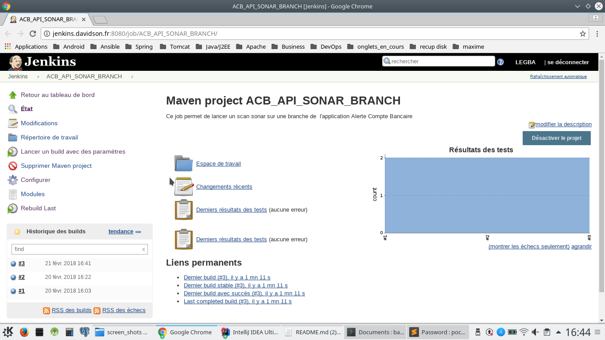

Alerte sur Compte Bancaire Ops (acb_ops) 
==

acb_ops est un projet d'intégration continue dédié à l'intégration et au déploiement de l'application [acb_api](https://github.com/eleDavLyon/acb_api "link to Alerte sur Compte bancaire"). Ce projet contient 2 parties :
* Jobs Jenkins : c'est l'ensemble des jobs Jenkins pour assurer l'intégration continue du projet
* Ansible : cette partie concerne les rôles Ansible nécessaires au déploiement de l'application Spring Boot sur les serveurs des environnements (Dev, Recette, Intmoa, Qualif, pre-prod, prod).

Jenkins
-

Jenkins est une plateforme d'intégration continue qui permet de gérer de façon automatiser certaines tâches.
En phase de développement, un job Jenkins permet de surveiller les évolutions de code, compiler et tester l'application.
Lorsqu'il y a des erreurs, les développeurs les corrigent. Ceci leur permet d'éviter de finir l'application et de corriger
les bugs en fin de phase de développement, ce qui est plus coûteux en terme de temps de travail.
Associé à d'autres plugins & outils (Sonar, Findbugs, PMD, etc..), Jenkins permet de mesurer la qualité du code et produit des couvertures de test.
Enfin, avec les jobs Jenkins, les intégrateurs effectuent plus facilement le déploiement continu des applications.

Dans cette étude de cas, tous les jobs sont créés en langage Groovy et sont versionnés sous Git.
Ensuite, avec le plugins [Job DSL](https://jenkinsci.github.io/job-dsl-plugin/ "link to Job DSL"), le code Groovy est converti en Job Jenkins utilisable.
Ecrire les jobs en Groovy permet de garantir les versionning des jobs. Si l'évolution d'un job comporte des bugs, on peut revenir à une version antérieure
grâce au versionning Git.
(TODO : commencer à regarder Pipeline)

Les jobs utilisés sont :
* ACB_API_SNAPSHOT_BRANCH : il permet de faire des snapshots d'une version de développement (version jugée instable) de l'application. Les livrables produits sont déposés sur un repositoryNexus.
* ACB_API_SONAR_BRANCH : ce job exécute les tests (unitaires et d'intégration) de l'application, scanne le code Java et transmet les résultat à un serveur [Sonar](https://jenkinsci.github.io/job-dsl-plugin/ "link to install Sonar").
Les résultats des tests et la qualité du code sont consultables sur Sonar.

* ACB_API_DEPLOIEMENT : ce job permet de déployer une version snapshot ou une release de l'application sur un environnement cible (Dev, qualif, prod, etc...). C'est un job qui combine les avantages de Jenkins, les scripts Shell et les rôles Ansible.

Les codes Groovy des jobs sont disponibles dans le répertoire ``job``. Les scripts Shell  utilisés sont dans le répertoire ``scripts``.

Ansible
-

[Ansible](http://docs.ansible.com/ansible/latest/playbooks_roles.html "link to install Ansible") est un logiciel open-source écrit en Python dédié au déploiement et à la configuration de serveurs à distance.
Il permet d'automatiser les tâches récurrentes d'administration système.
Ces tâches répétitives sont écrites dans des fichiers YAML appelés « Playbooks ».
C'est le contenu de ces « Playbooks » qu'Ansible exécute sur les serveurs distants.
L'une des force d'Ansible est sa capacité à déployer plusieurs serveurs (groupe d'hôtes) simultanément.
Dans ce contexte, nous avons écrit des [rôles](http://docs.ansible.com/ansible/latest/playbooks_roles.html "link to Rôle Ansible") Ansible  pour automatiser le déploiement des briques nécessaires au fonctionnement de l'application.

* firwall : ouverture des ports réseau avec iptables.
* openjdk8 : ce rôle installe sur le serveur de l'application un JDK 8 Java nécessaire pour exécuter le fatJar produit par Spring Boot.
* postgres : ce rôle installe un SGBD PostgreSQL et un schéma de base de données pour l'application.
* app_acb : ce rôle réalise toutes les actions nécessaires pour installer l'API proprement dit. Ainsi, il télécharge sur Nexus les librables de l'API, crée les répertoires nécessaires sur le serveur, initialise les configurations propres à l'environnement (paramètres serveurs SMTP par exemple), un script SystemD, etc...

Tous le code Ansible est disponible dans le répertoire ``ansible`` du projet.